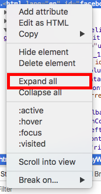

# 2017 in Review

This is just a fun lil project I did over winter break to recap things I did in 2017.

If you want to analyze your own Facebook data with the script that I made, here's what you need to do: 

### Let's Get Analyzing
Step 1- Open up your profile


Step 2- Open up your activity log


Step 3- Make sure the activity log filter is highlighted


Step 4- Start scrolling! Don't stop scrolling until you hit December 2016. My script only analyzes your interactions in 2017, so if you want to go further, you'll have to edit the script


Step 5- Left click on the page (two finger tap on Mac OS), and select "Inspect element"


Step 6- You should now see some HTML! Navigate to the line that says 

```
"<html lang="en" id="facebook" class="tinyViewport tinyWidth"> == $0"
```

and left tap on it. Then select "Expand all"



Step 7- Now, we want to copy all of this HTML. Navigate back to the same line, left tap on it, and now select "Edit as HTML."


Step 8- We're almost there! Copy and paste all of the HTML into your favorite text editor and create a new file called "sample.HTML"


Step 8.5- If you don't already have [node.js](https://nodejs.org/en/) installed on your computer, go download it! 

Step 9- Here comes the fun part! Open up your terminal, navigate to the folder that contains both "sample.html" and "reacts.js," and type in 

```
"node.js react > updated.txt"
```

(This basically runs the code in react.js on sample.html and places the output into updated.txt)

Step 10- Observe your data! The file "updated.txt" should now contain a breakdown of your Facebook interactions in 2017!